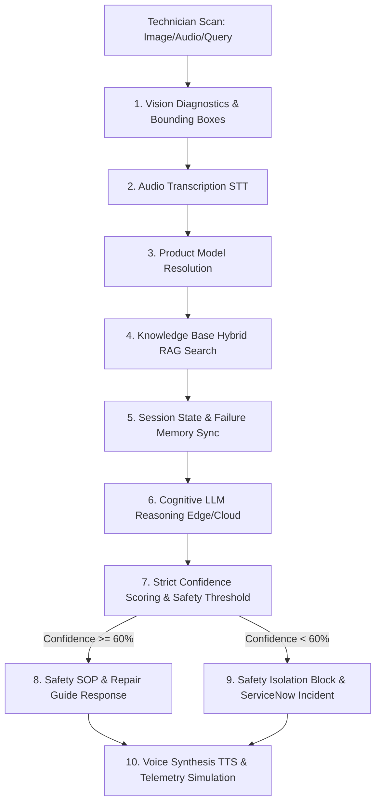

# Technical Architecture & Implementation Details: Smart Technician Assistant

This document provides a comprehensive technical breakdown of the **Apex Industrial AI Platform** (formerly Smart Technician Assistant). It details the system architecture, directory layouts, backend orchestration pipeline, hybrid RAG mechanics, database schemas, and edge/cloud scaling strategies.

---

## 1. Directory Structure & Key Components

The codebase is organized into modular services targeting offline edge resiliency, high-performance local indexing, and interactive mobile clients.

```
smart-technician-assistant/
│
├── backend/                             # FastAPI Backend Service
│   ├── main.py                          # Application entry point and router registry
│   ├── api/                             # Route controllers
│   │   ├── analyze.py                   # Main diagnostic pipeline orchestrator
│   │   ├── chat.py                      # Conversational RAG assistant
│   │   ├── admin.py                     # Manual uploading, scraping & analytics
│   │   └── vision.py, speech.py, etc.   # Specialized media/routing endpoints
│   │
│   ├── core/
│   │   └── config.py                    # Environment configuration loader
│   │
│   ├── database/
│   │   └── db_service.py                # SQLite wrapper for products, inspections & sessions
│   │
│   ├── llm/
│   │   └── reasoner.py                  # Core LLM diagnostics (Gemini & Ollama models)
│   │
│   ├── rag/
│   │   ├── document_processor.py        # Text splitting, clean-up & RAG loader
│   │   └── vector_store.py              # SQLite + NumPy vector DB & BM25 / RRF
│   │
│   ├── analytics/
│   │   └── scoring.py                   # Helper parsing logic for confidence matching
│   │
│   └── static/
│       ├── dashboard.html               # Operations Supervisor Dashboard (HTML/Chart.js)
│       └── uploads/                     # Cached images, audio files, and voice recordings
│
├── mobile-app/                          # React Native Mobile Frontend (Expo)
│   ├── App.tsx                          # App root and navigation definitions
│   └── src/                             # Views, layouts, and API clients
│
└── knowledge-base/                      # Standard Operating Procedures & Equipment Manuals
    ├── manuals/                         # HVAC and motor specs
    ├── sops/                            # Electrical isolation policies (Lockout/Tagout)
    └── repair-guides/                   # Assembly and diagnostic checklists
```

---

## 2. Core Backend Orchestration Pipeline

The main entry point for multimodal equipment diagnostic scanning is the `/analyze` endpoint inside [analyze.py](file:///c:/Smart%20Technician%20Assistant/backend/api/analyze.py). 

When a technician takes a photo of a failing component or records a voice description, the backend executes the following multi-stage pipeline:



### Stage-by-Stage Processing Logic

1. **Vision Diagnostics**:
   - If an image is uploaded, it is routed to the [analyzer.py](file:///c:/Smart%20Technician%20Assistant/backend/vision/analyzer.py) service.
   - It runs object classification and bounding-box drawing via Gemini Vision APIs or falls back to local heuristic detection in offline mock mode.
   - The annotated image is saved in the `/static` directory for UI overlay.

2. **Audio Transcription**:
   - Vocal technician descriptions are processed by the [stt_service](file:///c:/Smart%20Technician%20Assistant/backend/speech/stt.py) using Gemini audio transcription or local STT libraries, producing a raw text string.

3. **Product Model Resolution**:
   - The system matches query words against the SQLite product table using a weighted scoring function in [product_resolver.py](file:///c:/Smart%20Technician%20Assistant/backend/utils/product_resolver.py).
   - Scoring matrix:
     - Exact model match: `+100` points.
     - Product name match: `+80` points.
     - Model tokens match: `+15` points.
     - Manufacturer word matches: `+20` points.
     - Product name tokens: `+5` points.
   - A minimum score threshold of `10` is enforced to resolve a product configuration.

4. **URL Manual Scraping**:
   - If a technician submits an external manufacturer manual URL, the `/analyze` endpoint triggers [scraper.py](file:///c:/Smart%20Technician%20Assistant/backend/utils/scraper.py) to extract page body text.
   - The text is saved locally to a new file in `knowledge-base/manuals/`.
   - The product database is updated, and [document_processor.py](file:///c:/Smart%20Technician%20Assistant/backend/rag/document_processor.py) indexes it into the local vector database in a background thread.

5. **Hybrid RAG Retrieval**:
   - The vector store in [vector_store.py](file:///c:/Smart%20Technician%20Assistant/backend/rag/vector_store.py) executes a hybrid keyword and vector query search.
   - If a product model was resolved, the search is constrained (`allowed_files`) to the matched product manual and `electrical_safety_sop.txt`. If no model is matched, a broader search is run.

6. **Iterative Diagnostics (Failed Solutions Memory)**:
   - The session ID is used to fetch active state records from the `troubleshooting_sessions` table in SQLite.
   - If the technician has marked previously suggested steps as failed, the system pulls these strings.
   - These failed steps are passed to the reasoner, directing the model to adjust root-cause probability rankings and compile alternative repair steps.

7. **Cognitive LLM Reasoning**:
   - The reasoning service [reasoner.py](file:///c:/Smart%20Technician%20Assistant/backend/llm/reasoner.py) structures the system instruction prompts containing the raw RAG excerpts, vision annotations, and failure parameters.
   - The reasoning engine uses **Google Gemini 2.5-Flash** for cloud inference.
   - **Offline Edge Fallback**: If the cloud API is offline or the environment runs local compute, it switches to **Ollama** using lightweight SLMs (e.g., `llama3-8b`) accelerated via AMD ROCm.
   - The reasoner automatically detects the query language and translates the diagnostic results dynamically while maintaining the strict JSON return schema.

8. **Strict Confidence Calculation**:
   - To prevent hallucinations in industrial settings, a strict weighting math formula calculates the final grounding confidence percentage:
     $$\text{Final Confidence} = (0.35 \times C_{\text{Product}}) + (0.30 \times S_{\text{RAG}}) + (0.20 \times C_{\text{Fault}}) + (0.15 \times C_{\text{Grounding}})$$
     - $C_{\text{Product}}$: Product model detection resolution accuracy.
     - $S_{\text{RAG}}$: Fused Reciprocal Rank score from vector similarity search.
     - $C_{\text{Fault}}$: Visual defect detection confidence score.
     - $C_{\text{Grounding}}$: RAG context manual grounding confidence returned by the LLM.

9. **Safety Escalation Block**:
   - If the calculated confidence score falls below **60%**, the backend triggers a safety block:
     - Disables and clears the recommended repair steps.
     - Mutes Voice Synthesis.
     - Flags the session as `Escalated`.
     - Automatically generates a high-priority incident request pushed directly to ServiceNow.

10. **Voice Synthesis & Telemetry Simulation**:
    - If the check passes, the text-to-speech engine [tts.py](file:///c:/Smart%20Technician%20Assistant/backend/speech/tts.py) uses `gTTS` to generate an MP3 guide.
    - Telemetry curves (temperatures and vibrations) are generated dynamically based on the resolved product model and safety state: unresolved or high-severity cases trigger drifts and high temperatures.

---

## 3. Hybrid RAG Search Engine

The RAG platform combines semantic **Vector Search** (for conceptual context matching) with lexical **BM25 Search** (for exact keyword match, such as model numbers or error codes). The search logic is implemented inside [vector_store.py](file:///c:/Smart%20Technician%20Assistant/backend/rag/vector_store.py).

```mermaid
graph LR
    Query[User Query] --> Vector[Vector Search (Cosine Similarity)]
    Query --> BM25[Lexical Search (BM25)]
    Vector --> RRF[Reciprocal Rank Fusion (RRF)]
    BM25 --> RRF
    RRF --> Results[Fused & Ranked Results]
```

---

### 1. Reciprocal Rank Fusion (RRF)
RRF combines the rankings of documents from different search runs (Vector and BM25) into a single, unified list. Instead of using the raw similarity scores, it adds the **reciprocal of the rank** of each document plus a smoothing constant $k$ (default is `60`).

* **Concept**:
  $$\text{RRF Score}(d) = \frac{1}{60 + \text{Rank}_{\text{Vector}}(d)} + \frac{1}{60 + \text{Rank}_{\text{BM25}}(d)}$$
* **Rank**: The position of the document in the results list (0-indexed). The higher the ranking in both list results, the larger the final RRF score will be.

**Python Implementation:**
```python
def reciprocal_rank_fusion(vector_rankings, bm25_rankings, k=60):
    rrf_scores = {}
    
    # Process vector rankings
    for rank, doc in enumerate(vector_rankings):
        doc_id = doc["id"]
        rrf_scores[doc_id] = {"doc": doc, "score": 1.0 / (k + rank + 1)}
        
    # Process BM25 rankings
    for rank, doc in enumerate(bm25_rankings):
        doc_id = doc["id"]
        if doc_id not in rrf_scores:
            rrf_scores[doc_id] = {"doc": doc, "score": 0.0}
        rrf_scores[doc_id]["score"] += 1.0 / (k + rank + 1)
        
    # Sort docs descending by fused RRF score
    sorted_docs = sorted(rrf_scores.values(), key=lambda x: x["score"], reverse=True)
    return [(item["doc"], item["score"]) for item in sorted_docs]
```

---

### 2. Lexical Search (BM25)
BM25 ranks document chunks based on how well they match the query's words. It calculates a score by taking into account:
1. **Inverse Document Frequency (IDF)**: Common words (like "the", "and") receive low scores, while rare words (like "LOTO", "AC-X200") receive high scores.
2. **Term Frequency Saturation**: The more a query word appears in a document, the higher its score, but this effect tapers off to prevent keyword stuffing.
3. **Document Length Normalization**: Shorter document chunks that contain query words are favored over longer, wordy document chunks.

**Python Implementation:**
```python
class BM25:
    def __init__(self, corpus, k1=1.5, b=0.75):
        self.k1 = k1   # Controls term frequency scaling (saturation)
        self.b = b     # Controls document length normalization scaling
        self.corpus = corpus
        self.doc_len = [len(tokenize(doc['text'])) for doc in corpus]
        self.avg_doc_len = sum(self.doc_len) / len(self.doc_len) if corpus else 0
        self.doc_count = len(corpus)
        self.df = self._calc_df()
        self.idf = self._calc_idf()

    def get_score(self, query_tokens, doc_idx):
        score = 0.0
        doc_words = tokenize(self.corpus[doc_idx]['text'])
        word_counts = {w: doc_words.count(w) for w in set(doc_words)}
        Ld = self.doc_len[doc_idx]
        
        for token in query_tokens:
            if token not in self.idf:
                continue
            f = word_counts.get(token, 0)
            # BM25 score formula computation
            numerator = self.idf[token] * f * (self.k1 + 1)
            denominator = f + self.k1 * (1 - self.b + self.b * (Ld / self.avg_doc_len))
            score += numerator / denominator
        return score
```

---

## 4. SQLite Database Schema

The local persistence layer in [db_service.py](file:///c:/Smart%20Technician%20Assistant/backend/database/db_service.py) consists of four primary tables managed directly using standard Python `sqlite3` execution chains.

### 1. `products`
Stores registered catalog items, mapping physical models to local document paths.
| Column | Type | Constraints / Description |
| :--- | :--- | :--- |
| `id` | INTEGER | PRIMARY KEY AUTOINCREMENT |
| `product_name` | TEXT | Not Null. (e.g., "HVAC Compressor AC-X200") |
| `manufacturer` | TEXT | Not Null. |
| `model_number` | TEXT | Not Null, UNIQUE. |
| `manual_filename` | TEXT | Not Null. Link to manual file. |
| `description` | TEXT | Optional description. |
| `created_at` | TEXT | ISO timestamp. |

### 2. `inspection_history`
Maintains an audit trail of all scans.
| Column | Type | Constraints / Description |
| :--- | :--- | :--- |
| `id` | INTEGER | PRIMARY KEY AUTOINCREMENT |
| `timestamp` | TEXT | Not Null. |
| `image_path` | TEXT | Path to saved upload on disk. |
| `detected_issue` | TEXT | Name of identified equipment anomaly. |
| `confidence` | TEXT | Final calculated confidence score. |
| `root_cause` | TEXT | Detailed diagnostic text. |
| `suggested_steps` | TEXT | JSON string array of repair steps. |
| `safety_recommendations`| TEXT | Active safety SOP parameters. |
| `audio_url` | TEXT | Voice guide output MP3 URL path. |
| `query_text` | TEXT | User input or transcribed query. |
| `inference_node` | TEXT | Hardware node executing reasoning. |

### 3. `troubleshooting_sessions`
Supports state preservation across multi-step repair workflows.
| Column | Type | Constraints / Description |
| :--- | :--- | :--- |
| `session_id` | TEXT | PRIMARY KEY. UUID or custom string. |
| `created_at` | TEXT | ISO timestamp. |
| `detected_issue` | TEXT | Detected anomaly. |
| `severity_level` | TEXT | Low, Medium, High, or Critical. |
| `confidence_score` | TEXT | Grounding score string. |
| `root_cause_rankings` | TEXT | JSON list of ranked causes. |
| `suggested_steps` | TEXT | JSON list of suggested actions. |
| `safety_recommendations`| TEXT | Current safety recommendations. |
| `failed_steps` | TEXT | JSON array of failed actions (Session Memory). |
| `image_url` | TEXT | Annotated picture reference. |
| `query_text` | TEXT | Active session query text. |
| `inference_node` | TEXT | Execution runtime tracker. |

### 4. `feedback_history`
Tracks repair success logs to feed back into the scoring engine.
| Column | Type | Constraints / Description |
| :--- | :--- | :--- |
| `id` | INTEGER | PRIMARY KEY AUTOINCREMENT |
| `session_id` | TEXT | Session reference link. |
| `user_issue` | TEXT | Identified issue type. |
| `suggested_repair` | TEXT | Suggested repair text. |
| `was_successful` | INTEGER | Boolean (1 = Success, 0 = Failure). |
| `repair_duration` | INTEGER | Time taken in minutes. |
| `user_rating` | INTEGER | Star rating (1 to 5). |
| `timestamp` | TEXT | ISO timestamp. |

---

## 5. API Endpoints Reference

This section details the REST endpoints available on the FastAPI backend, including content types, request/response structures, and database interfaces.

### 📋 API Directory Overview

| Method | Endpoint | Request Content-Type | Description |
| :--- | :--- | :--- | :--- |
| `POST` | `/analyze` | `multipart/form-data` | Main multimodal diagnostic scan (Image, Audio, and text RAG). |
| `POST` | `/query` | `application/x-www-form-urlencoded` | Text-only hybrid RAG query. |
| `POST` | `/chat` | `application/json` | Conversational RAG assistant (multi-turn). |
| `POST` | `/feedback` | `application/json` | Records repair success/failure and feedback. |
| `POST` | `/generate-solution` | `application/json` | Generates alternative troubleshooting steps for failed sessions. |
| `POST` | `/upload-image` | `multipart/form-data` | Standalone image diagnosis. |
| `POST` | `/upload-audio` | `multipart/form-data` | Standalone audio speech-to-text. |
| `GET` | `/history` | None | Retrieves past diagnostic records and ratings. |
| `GET` | `/admin/analytics` | None | Retrieves dashboard operational metrics summary. |
| `GET` | `/admin/products` | None | Lists all registered product model records. |
| `POST` | `/admin/products` | `application/json` | Registers a new product model configuration. |
| `DELETE` | `/admin/products/{id}` | None | Deletes a product registration by database ID. |
| `POST` | `/admin/add-manual-text` | `application/json` | Uploads manual text directly and indexes in RAG. |
| `POST` | `/admin/add-manual-url` | `application/json` | Scrapes external manual web URLs and indexes in RAG. |
| `DELETE` | `/admin/manuals/{category}/{file}` | None | Deletes a manual document and purges its vector index chunks. |

---

### 📡 Core Diagnostic & Assistant APIs

#### 1. `POST /analyze`
Coordinates the core multimodal diagnostic scan. This endpoint processes incoming images, audio, queries, and manual URLs.

* **Content-Type**: `multipart/form-data`
* **Request Fields**:
  | Field | Type | Required/Optional | Description |
  | :--- | :--- | :--- | :--- |
  | `image` | File | Optional | JPG/PNG image of the failing machinery. |
  | `audio` | File | Optional | Audio recording of the technician's voice query. |
  | `query` | Form Parameter (Text) | Optional | Text search query or symptom description. |
  | `session_id` | Form Parameter (Text) | Optional | Unique ID to maintain diagnostic history and failed steps memory. |
  | `manual_url` | Form Parameter (Text) | Optional | URL of a manual to scrape and index on-the-fly. |

* **Example JSON Response**:
  ```json
  {
    "session_id": "sess_f0a8d29b",
    "loto_enforced": true,
    "loto_steps": [
      "Verify circuit breaker/power switch is in OFF position",
      "Apply personal padlock and Lockout Tag to the isolation point"
    ],
    "image_url": "/static/uploads/images/annotated_leak.jpg",
    "query_text": "pump is leaking water",
    "detected_issue": "Centrifugal Pump Leakage",
    "confidence_score": "84.2%",
    "repair_success_probability": "78.5%",
    "severity_level": "High",
    "root_cause_rankings": [
      { "cause": "Damaged O-rings or casing gaskets", "probability": "72%" },
      { "cause": "Worn mechanical seal", "probability": "58%" }
    ],
    "reasoning_explanation": "Visual inspection shows water pooling at the casing base. RAG manuals indicate split gaskets or seal wear under thermal load.",
    "suggested_steps": [
      "From industrial_pump_leak_guide.txt: Isolate and de-pressurize the fluid line. Shut down power using LOTO.",
      "From industrial_pump_leak_guide.txt: Undo casing bolts in a cross-pattern to inspect gaskets."
    ],
    "safety_recommendations": "Isolate power supply and wear insulated safety gloves.",
    "tts_audio_url": "/static/speech_f0a8d29b.mp3",
    "rag_sources": [
      "industrial_pump_leak_guide.txt",
      "electrical_safety_sop.txt"
    ],
    "telemetry": {
      "remaining_useful_life": "48%",
      "vibration_deviation": [0.08, 0.11, 0.15, 0.22, 0.29],
      "temperature_logs": [44.0, 48.5, 53.0, 59.2, 65.0]
    },
    "enterprise_integrations": {
      "sap_work_order": "WO-2026-90812",
      "maximo_asset_id": "MX-PUMP-100",
      "servicenow_incident": "INC890812",
      "sync_status": "Escalated"
    }
  }
  ```

#### 2. `POST /query`
Processes text-only diagnostic lookups using the hybrid RAG search pipeline.

* **Content-Type**: `application/x-www-form-urlencoded`
* **Request Fields**:
  | Field | Type | Required/Optional | Description |
  | :--- | :--- | :--- | :--- |
  | `query` | Form Parameter (Text) | **Required** | Lexical/semantic query or question about standard manuals. |

#### 3. `POST /chat`
Conversational RAG assistant allowing multi-turn technical Q&A grounded strictly in manual contexts.

* **Content-Type**: `application/json`
* **Request Schema**:
  | Field | Type | Required/Optional | Description |
  | :--- | :--- | :--- | :--- |
  | `message` | String | **Required** | The technician's message text. |
  | `history` | Array | Optional | List of preceding chat messages matching the schema `[{"role": "user"\|"model", "content": "..."}]`. |

  ```json
  {
    "message": "What kind of safety gloves should I use?",
    "history": [
      { "role": "user", "content": "Checking control cabinet SOP-ELEC-04" },
      { "role": "model", "content": "Proceeding with electrical inspection." }
    ]
  }
  ```
* **Response Payload**:
  ```json
  {
    "response": "According to electrical_safety_sop.txt, wear Class E insulated safety gloves rated for 1000V.",
    "sources": ["electrical_safety_sop.txt"],
    "inference_node": "CLOUD GEMINI"
  }
  ```

---

### 🔄 Feedback & Solution Memory APIs

#### 4. `POST /feedback`
Records technician feedback after completing a repair, adjusting future AI scoring parameters.

* **Content-Type**: `application/json`
* **Request Schema**:
  | Field | Type | Required/Optional | Description |
  | :--- | :--- | :--- | :--- |
  | `session_id` | String | **Required** | Unique ID for the active troubleshooting session. |
  | `was_successful` | Boolean | **Required** | True if the repair worked; False if it failed. |
  | `user_rating` | Integer | Optional | Star rating from 1 to 5 (default: 5). |
  | `repair_duration` | Integer | Optional | Time taken to complete the repair in minutes (default: 0). |

  ```json
  {
    "session_id": "sess_f0a8d29b",
    "was_successful": false,
    "user_rating": 3,
    "repair_duration": 25
  }
  ```
* **Response Payload**:
  ```json
  {
    "status": "success",
    "message": "Feedback registered successfully.",
    "session_id": "sess_f0a8d29b",
    "was_successful": false,
    "failed_steps_count": 2
  }
  ```

#### 5. `POST /generate-solution`
Generates an alternative troubleshooting solution path when previous steps fail. It adjusts causes and excludes failed actions.

* **Content-Type**: `application/json`
* **Request Schema**:
  | Field | Type | Required/Optional | Description |
  | :--- | :--- | :--- | :--- |
  | `session_id` | String | **Required** | Session ID of the active repair run. |
  | `query` | String | Optional | Custom query for alternative diagnostic routing. |

  ```json
  {
    "session_id": "sess_f0a8d29b",
    "query": "alternative repair options"
  }
  ```
* **Response Payload**: Identical structure to `POST /analyze`, with re-ranked causes and alternative step arrays.

---

### 📷 Standalone Media APIs

#### 6. `POST /upload-image`
Independent diagnostic inference on an uploaded photo.
* **Content-Type**: `multipart/form-data`
* **Request Fields**:
  | Field | Type | Required/Optional | Description |
  | :--- | :--- | :--- | :--- |
  | `file` | File | **Required** | Image file to diagnose. |

* **Response**: Returns `image_url` (annotated path), `detected_issue`, `confidence`, and `visual_findings`.

#### 7. `POST /upload-audio`
Independent voice transcription.
* **Content-Type**: `multipart/form-data`
* **Request Fields**:
  | Field | Type | Required/Optional | Description |
  | :--- | :--- | :--- | :--- |
  | `file` | File | **Required** | Audio file to transcribe. |

* **Response**: Returns `audio_url` and `transcription`.

#### 8. `GET /history`
Retrieves past diagnostics and feedback audits in chronological order.
* **Response**: A JSON object containing inspections data and rating distributions.

---

### 🛠️ Admin & Knowledge Base Management APIs

#### 9. `GET /admin/products`
Retrieves all catalog items mapping models to manuals.

#### 10. `POST /admin/products`
Registers a new product configuration mapping in the DB.
* **Content-Type**: `application/json`
* **Request Schema**:
  | Field | Type | Required/Optional | Description |
  | :--- | :--- | :--- | :--- |
  | `product_name` | String | **Required** | Descriptive name (e.g., "HVAC Compressor AC-X200"). |
  | `manufacturer` | String | **Required** | Manufacturer name. |
  | `model_number` | String | **Required** | Model identifier. |
  | `manual_filename` | String | **Required** | Filename of the manual document inside `knowledge-base`. |
  | `description` | String | Optional | General details about the machinery model. |

#### 11. `DELETE /admin/products/{id}`
Deletes a product mapping by database ID.

#### 12. `POST /admin/add-manual-text`
Creates a manual document directly from text input and trigger re-indexing.
* **Content-Type**: `application/json`
* **Request Schema**:
  | Field | Type | Required/Optional | Description |
  | :--- | :--- | :--- | :--- |
  | `product_name` | String | **Required** | Descriptive name. |
  | `manufacturer` | String | **Required** | Manufacturer name. |
  | `model_number` | String | **Required** | Model identifier. |
  | `manual_text` | String | **Required** | Full text content of the manual. |
  | `description` | String | Optional | General details about the machinery model. |
  | `category` | String | Optional | Category folder (e.g., `manuals`, `sops`, `repair-guides`). Default: `manuals`. |

#### 13. `POST /admin/add-manual-url`
Scrapes external web manual URLs, saves as local text, and re-indexes into RAG.
* **Content-Type**: `application/json`
* **Request Schema**:
  | Field | Type | Required/Optional | Description |
  | :--- | :--- | :--- | :--- |
  | `product_name` | String | **Required** | Descriptive name. |
  | `manufacturer` | String | **Required** | Manufacturer name. |
  | `model_number` | String | **Required** | Model identifier. |
  | `url` | String | **Required** | External URL path to scrape and index into the RAG vector db. |
  | `description` | String | Optional | General details. |
  | `category` | String | Optional | Category folder (e.g., `manuals`, `sops`, `repair-guides`). Default: `manuals`. |

#### 14. `DELETE /admin/manuals/{category}/{filename}`
Removes a manual document from disk and deletes its chunk index from the vector database.

---

## 6. Security & Safety Compliance Policies

### Lockout/Tagout (LOTO) Compliance
If safety keywords (e.g., "high voltage", "pressure lines", "breaker") are detected in safety recommendations, LOTO enforcement triggers:
1. The backend sets `loto_enforced` to `True`.
2. Generates four mandatory safety checkout steps (e.g., "Verify absence of voltage using a calibrated multimeter").
3. The React Native mobile UI displays physical check-boxes that lock repair details until the technician signs off on each safety state.

### Enterprise Escalations
If RAG grounding fails or final confidence falls below **60%**, the platform enforces safety isolation:
- Suggested repair guides are blocked to prevent unsafe guesses.
- A ServiceNow incident ticket (`INCXXXXXX`) is opened to call a senior supervisor.
- In SAP PM, the status is set to `PM02` (Breakdown/Emergency Work Order) for audit tracing.
